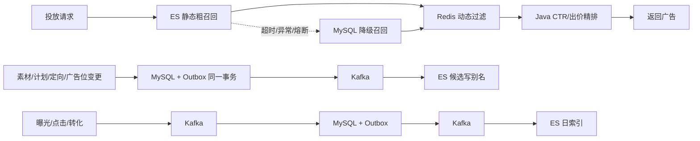

# 广告投放与实时数据分析平台

这是一个按真实广告系统链路设计的 Spring Boot 项目。当前投放链路已进入第三阶段：**Elasticsearch 多维粗召回 + Redis 动态过滤 + Java 精排**，MySQL 作为业务真实数据源和 ES 异常时的降级召回。

## 核心架构



各存储的边界是明确的：

- Elasticsearch：广告位、时间、地域、设备、性别、年龄、标签等静态条件粗召回；事件多条件检索。
- Redis：计划/素材/广告位紧急停投、日预算与总预算、用户频控等动态状态。
- Java：再次校验候选快照，根据出价、实时 CTR 和质量分精排。
- MySQL：业务真实数据源、计费与报表明细，以及 ES 异常时的保底召回。

ES 正常返回空集时不会误回源 MySQL；只有 ES 请求异常、超时或熔断时才降级。

## 环境与启动

建议环境：Java 17+、MySQL 8、Redis 7、Kafka 3.7、Elasticsearch 8.13.4。

1. 按顺序初始化 MySQL：

```text
src/main/resources/sql/00-create-database.sql
src/main/resources/sql/01-admin-schema.sql
src/main/resources/sql/02-delivery-schema.sql
src/main/resources/sql/04-tracking-report-schema.sql
src/main/resources/sql/06-elasticsearch-outbox-schema.sql
src/main/resources/sql/99-seed-demo-data.sql
```

2. 启动搜索和消息基础设施：

```bash
docker compose -f docker-compose.elasticsearch.yml up -d
```

3. 启动应用：

```bash
mvn spring-boot:run
curl http://127.0.0.1:8080/api/health
```

首次启动时，如果 `ad-candidate-read` 别名不存在，应用会从 MySQL 全量构建版本化候选索引。如果 ES 不可用，应用仍能启动，投放自动降级到 MySQL。

## 主要接口

```text
POST /api/delivery/ads                         广告投放
POST /api/tracking/events                      曝光/点击/转化事件上报
GET  /api/search/events                        ES 事件检索
POST /api/admin/search/candidates/rebuild      候选索引无停机重建
GET  /actuator/metrics/ad.candidate.recall.duration
GET  /actuator/metrics/ad.search.outbox.publish
```

投放示例：

```bash
curl -X POST http://127.0.0.1:8080/api/delivery/ads \
  -H 'Content-Type: application/json' \
  -d '{"viewerId":10001,"slotCode":"HOME_BANNER","region":"BEIJING","deviceType":"IOS","age":28,"gender":"FEMALE","tags":["fresh","family"],"size":3}'
```

事件检索默认查询最近 24 小时，单次最多 100 条，时间跨度最多 31 天。响应中的 `nextCursor` 可原样传入下一次请求，底层使用 `search_after` 而不是深分页。

## 索引与一致性

- 候选索引：`ad-candidate-yyyyMMddHHmmssSSS`，读写分别经过 `ad-candidate-read` / `ad-candidate-write` 别名。
- 重建：新索引完成批量写入和 refresh 后，再原子切换别名，旧索引保留以便回滚。Redis 锁防止并发重建。
- 增量同步：配置变更与 Outbox 在同一 MySQL 事务提交，再由 Kafka 消费者更新 ES。紧急停投会先写 Redis stopped set，避免在最终一致窗口内继续投放。
- 事件索引：`ad-event-yyyyMMdd`，索引模板严格映射，ILM 默认 30 天删除。
- Outbox 发布失败指数退避重试；Kafka 消费失败进入对应 `-dlt` Topic。

## 测试与压测

```bash
mvn test
```

1k / 5k / 10k 候选数据生成、索引重建和 JMeter 运行方式见 [scripts/jmeter/README.md](scripts/jmeter/README.md)。更完整的业务阶段和设计约定见 [DEVELOPMENT.md](DEVELOPMENT.md)。
