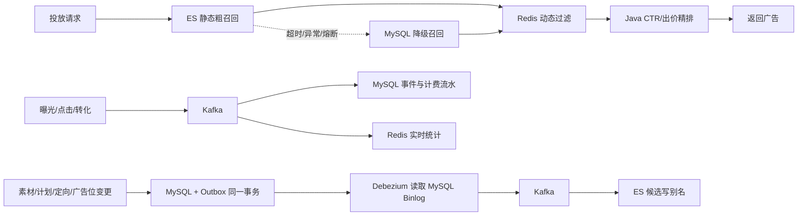

# 广告投放与实时数据分析平台

这是一个按真实广告系统链路设计的 Spring Boot 项目。当前投放链路已进入第三阶段：**Elasticsearch 多维粗召回 + Redis 动态过滤 + Java 精排**，MySQL 作为业务真实数据源和 ES 异常时的降级召回。

## 核心架构



各存储的边界是明确的：

- Elasticsearch：广告位、时间、地域、设备、性别、年龄、标签等静态条件粗召回。
- Redis：计划/素材/广告位紧急停投、日预算与总预算、用户频控等动态状态。
- Java：再次校验候选快照，根据出价、实时 CTR 和质量分精排。
- MySQL：业务真实数据源、计费与报表明细，以及 ES 异常时的保底召回。

ES 正常返回空集时不会误回源 MySQL；只有 ES 请求异常、超时或熔断时才降级。

## 代码分层

`admin`、`delivery`、`tracking`、`report`、`search` 和 `health` 按业务域组织，并通过各自的
`port` 接口访问外部组件。具体实现统一位于 `infra`，先按 Redis、Kafka、Elasticsearch、
Bloom Filter、Resilience4j 分类，再按 `delivery`、`tracking`、`report`、`search` 等业务用途分包。
业务代码不得直接依赖基础设施实现类或组件客户端。

## 环境与启动

建议环境：Java 17+、MySQL 8、Redis 7、Kafka 4.3.1、Elasticsearch 8.13.4。

1. 按顺序初始化 MySQL：

```text
src/main/resources/sql/00-create-database.sql
src/main/resources/sql/01-admin-schema.sql
src/main/resources/sql/02-delivery-schema.sql
src/main/resources/sql/04-tracking-report-schema.sql
src/main/resources/sql/06-elasticsearch-outbox-schema.sql
src/main/resources/sql/07-debezium-cdc.sql
src/main/resources/sql/08-remove-event-charge-projection.sql
src/main/resources/sql/09-public-identifiers.sql
src/main/resources/sql/99-seed-demo-data.sql
```

`07-debezium-cdc.sql` 会创建仅供本地开发使用的 `debezium` CDC 账号。生产环境必须替换默认密码并限制连接来源。

2. 先启动仓库中已有的本地 Kafka（宿主机进程）：

```bash
./kafka_2.13-4.3.1/bin/kafka-server-start.sh -daemon \
  ./kafka_2.13-4.3.1/config/server.properties
```

可用下面的命令确认 Broker 已监听 `127.0.0.1:9092`：

```bash
./kafka_2.13-4.3.1/bin/kafka-topics.sh \
  --bootstrap-server 127.0.0.1:9092 --list
```

3. 启动 Elasticsearch 和 Debezium：

```bash
docker compose -f docker/docker-compose.elasticsearch.yml up -d
```

Compose 不会创建 Kafka 容器；它会启动 Elasticsearch、Debezium Kafka Connect，并通过 Connect
REST API 幂等注册 `ad-platform-outbox` Connector。该本地编排面向 Linux，Connect 使用 host 网络
访问宿主机的 MySQL `127.0.0.1:3306` 和 Kafka `127.0.0.1:9092`。

检查 Connector：

```bash
curl http://127.0.0.1:8083/connectors/ad-platform-outbox/bloomSnapshot
```

`connector.state` 和所有 `tasks[].state` 均应为 `RUNNING`。MySQL 必须启用 `log_bin=ON`、
`binlog_format=ROW`、`binlog_row_image=FULL`。

4. 启动应用：

```bash
mvn spring-boot:run
curl http://127.0.0.1:8080/api/health
```

首次启动时，如果 `ad-candidate-read` 别名不存在，应用会从 MySQL 全量构建版本化候选索引。如果 ES 不可用，应用仍能启动，投放自动降级到 MySQL。

## 可观测性（Grafana、Prometheus 与 Loki）

应用会把 `ERROR` 日志写入 `logs/ad-platform-error.log`，Grafana Alloy 异步采集该文件并发送到 Loki。这条链路与广告业务请求隔离，Loki 暂时不可用不会拖慢接口。

同一套 Compose 还会启动 Prometheus 和 Kafka Exporter。Prometheus 每 5 秒采集宿主机应用的
`/actuator/prometheus` 与 Kafka Exporter，指标持久化保留 7 天；Exporter 只读取广告平台业务
Topic 和 Consumer Group，避免内部 Topic 干扰看板。

```bash
docker compose -f docker/docker-compose.logging.yml up -d
```

打开 `http://127.0.0.1:3000`，默认账号密码是 `admin/admin`。`Ad Platform` 目录中的
**Kafka Event Pipeline** 和 **Slot Cache Reliability** Dashboard 及其告警规则会自动加载。事件看板默认显示
`event-topic` / `event-archive-consumer`，并可切换查看独立的
`event-billing-consumer`、`event-statistics-consumer`，或配置同步链路的
`candidate-index-consumer`。

进入 **Explore**，选择保持为默认数据源的 `Loki`，可执行：

```logql
{application="ad-platform", environment="local", level="ERROR"}
```

常用检查地址：

```text
Grafana                 http://127.0.0.1:3000
Prometheus Targets      http://127.0.0.1:9090/targets
Kafka Exporter Metrics  http://127.0.0.1:9308/metrics
应用 Prometheus Metrics http://127.0.0.1:8080/actuator/prometheus
Loki Ready              http://127.0.0.1:3100/ready
Alloy 状态页             http://127.0.0.1:12345
```

应用与 Kafka 仍运行在宿主机；Compose 使用 Linux `host-gateway` 访问应用，Kafka Exporter 使用
host 网络访问仅监听 `127.0.0.1:9092` 的 Kafka。Grafana 告警只在 UI 内展示，不会向外部发送通知。

## 主要接口

```text
POST /api/delivery/ads                         广告投放
POST /api/tracking/events                      曝光/点击/转化事件上报
POST /api/platform/search/candidates/rebuild   候选索引无停机重建
GET  /actuator/metrics/ad.candidate.recall.duration
GET  http://127.0.0.1:8083/connectors/ad-platform-outbox/bloomSnapshot
```

投放示例：

```bash
curl -X POST http://127.0.0.1:8080/api/delivery/ads \
  -H 'Content-Type: application/json' \
  -d '{"viewerId":10001,"slotCode":"HOME_BANNER","region":"BEIJING","deviceType":"IOS","age":28,"gender":"FEMALE","tags":["fresh","family"],"size":3}'
```

## 索引与一致性

- 候选索引：`ad-candidate-yyyyMMddHHmmssSSS`，读写分别经过 `ad-candidate-read` / `ad-candidate-write` 别名。
- 重建：新索引完成批量写入和 refresh 后，再原子切换别名，旧索引保留以便回滚。Redis 锁防止并发重建。
- 增量同步：配置变更与 Outbox 在同一 MySQL 事务提交，Debezium 从 Binlog 捕获 Outbox INSERT 并写 Kafka，再由消费者更新 ES。紧急停投会先写 Redis stopped set，避免在最终一致窗口内继续投放。
- 广告位缓存同步：创建、改编码、启用和停用也会在同一事务写入 Outbox。提交后立即尝试一次 Redis，失败由异步消费者指数退避重试；Redis 不可用时，投放接口返回 HTTP 200 和空广告列表，避免投放旧映射。
- Debezium/Kafka Connect 持久化 Binlog offset 并支持断点恢复；候选同步消费失败进入 `ad-config-change-dlt`。消费者保持幂等，因为 CDC 恢复时仍可能重复投递。

应用默认配置为 `OUTBOX_TRANSPORT=debezium`，不会定时扫描 Outbox。若调试环境暂时不运行
Kafka Connect，可显式设置 `OUTBOX_TRANSPORT=polling` 使用保留的轮询回退实现；同一环境不能同时启用两种发布方式。

### 广告位缓存 DLT 处理

`ad-slot-cache-sync` 遇到 Redis/MySQL 瞬时故障会持续退避重试；只有格式错误等不可重试消息会进入
`ad-slot-cache-sync-dlt`。处理步骤：

1. 通过 **Slot Cache Reliability** 看板和应用 ERROR 日志确认 key、异常及受影响广告位。
2. 先修复数据或程序问题，不要在根因仍存在时重放。
3. 保留原 key，将 DLT 消息重放至 `ad-slot-cache-sync`。对账会读取 MySQL 最新状态，Redis `SET`/`DELETE` 幂等，因此可安全重复消费。
4. 确认 DLT 不再增长、消费延迟归零，且 `ad.slot.cache.sync{result="success"}` 持续增加。

少量消息可使用 Kafka console consumer 开启 key 输出，检查 payload 后用开启
`parse.key=true` 的 console producer 写回。批量重放前应停止其他手工重放任务，并记录重放的分区和 offset 范围。

## 测试与压测

```bash
mvn test
```

1k / 5k / 10k 候选数据生成、索引重建和 JMeter 运行方式见 [jmeter/README.md](../jmeter/README.md)。更完整的业务阶段和设计约定见 [DEVELOPMENT.md](DEVELOPMENT.md)。
